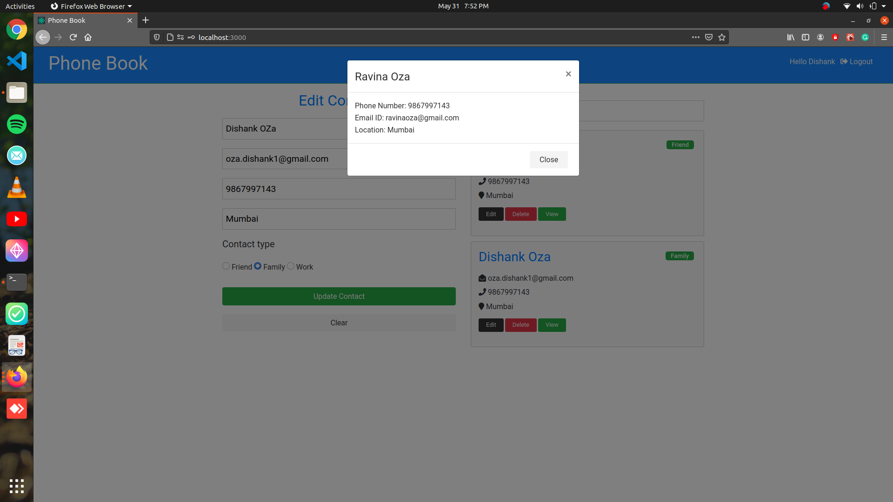

# PhoneBook

##Table of contents
* [General info](#general-info)
* [Technologies](#technologies)
* [Pre-requisites](#pre-requisites)
* [Setup](#setup)
* [Demo](#demo)

## General info
This project is simple phonebook web which allows user to add, delete, edit contacts.

## Technologies
Project is created with:
* Node
* MongoDB
* React
* JWT

## Pre-requisites
* Npm
* Nodejs
* MongoDB

## Setup
To run this project, open two terminal and enter following cmds:

Terminal 1
```
$ cd PhoneBook
$ npm install
$ npm run server
```
Terminal 2
```
$ cd PhoneBook
$ cd client
$ npm install
$ npm start
```
## Demo
**Sign Up Page**


**Login Page**


**Contacts Page(here you can add, edit and delete your contacts)**


**View Contact Page**

